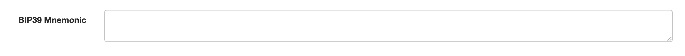

# Citadel Recovery

A tool for converting BIP39 mnemonic phrases to addresses and private keys for Hedera.

## Current Support

> **Note:** At the moment, this tool only supports **ECDSA** (secp256k1) key derivation.  
> Support for **ED25519** is **not yet implemented**.  
> Future release may allow switching between key types.

## Standalone offline version

Download `bip39-standalone.html` from
[the releases](https://github.com/buidler-labs/citadel-key-recovery/releases).

Open the file in a browser by double clicking it.

This can be compiled from source using the command `python compile.py`

## Usage Guide

### 1. Enter or Generate a BIP39 Phrase

You have two options:

- **Manually:** Paste your existing BIP39 phrase into the **"BIP39 Phrase"** input field.
    

- **Automatically:** Click the **"GENERATE"** button to create a new random mnemonic, **but before clicking "GENERATE"**, select how many words you want (e.g., 12, 15, 24).
    

---

### 2. (Optional) Set the Derivation Path

If needed, set a custom derivation path.  
The default is usually sufficient (e.g., `m/44'/3030'/0'/0` for HBAR).

---

### 3. Select the HBAR Coin

From the **“Coin”** dropdown, select **HBAR – Hedera** to ensure the correct derivation parameters are used.

---

### 4. View Generated Addresses

See the table below for a list of addresses derived from your BIP39 phrase, along with their corresponding public and private keys.

# License

This work is built upon Ian Coleman's excelent work! 

This BIP39 tool is released under the terms of the MIT license. See LICENSE for
more information or see https://opensource.org/licenses/MIT.
